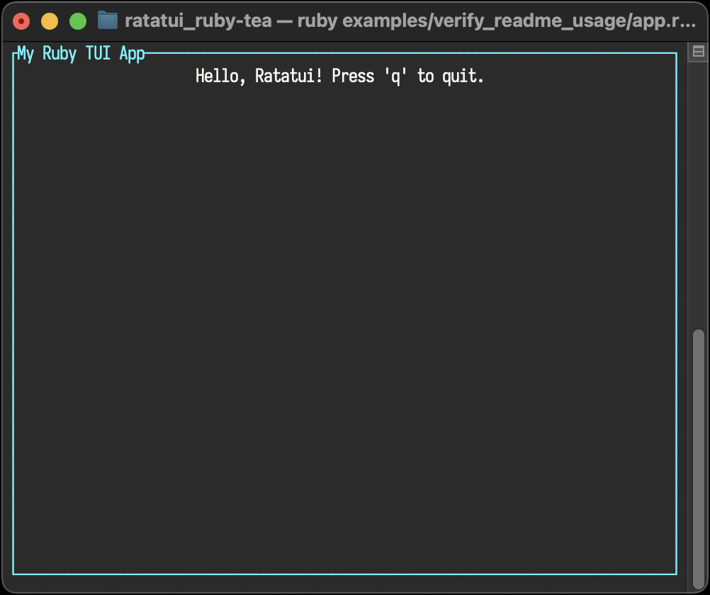

<!--
SPDX-FileCopyrightText: 2026 Kerrick Long <me@kerricklong.com>
SPDX-License-Identifier: CC-BY-SA-4.0
-->

# README Usage Verification

Verifies the primary usage example for the Tea gem.

This example exists as a documentation regression test. It ensures that the very first MVU pattern a user sees actually works.

## Usage

<!-- SPDX-SnippetBegin -->
<!--
  SPDX-FileCopyrightText: 2026 Kerrick Long
  SPDX-License-Identifier: MIT-0
-->
<!-- SYNC:START:./app.rb:mvu -->
```ruby
Model = Data.define(:text)
MODEL = Model.new(text: "Hello, Ratatui! Press 'q' to quit.")

VIEW = -> (model, tui) do
  tui.paragraph(
    text: model.text,
    alignment: :center,
    block: tui.block(
      title: "My Ruby TUI App",
      borders: [:all],
      border_style: { fg: "cyan" }
    )
  )
end

UPDATE = -> (msg, model) do
  if msg.q? || msg.ctrl_c?
    RatatuiRuby::Tea::Cmd.quit
  else
    model
  end
end

def run
  RatatuiRuby::Tea.run(model: MODEL, view: VIEW, update: UPDATE)
end
```
<!-- SYNC:END -->
<!-- SPDX-SnippetEnd -->

[](../../README.md#usage)
