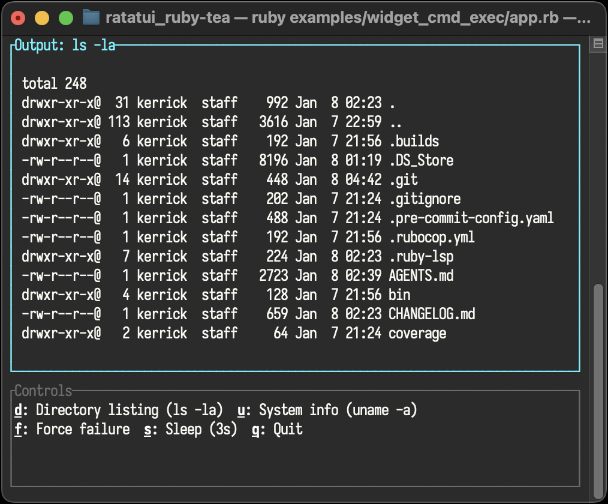

<!--
  SPDX-FileCopyrightText: 2026 Kerrick Long <me@kerricklong.com>
  SPDX-License-Identifier: CC-BY-SA-4.0
-->
# Cmd.exec Example

Demonstrates running shell commands using `Cmd.exec`.

Commands in TEA produce **messages**, not callbacks. When a command completes, the runtime sends a tagged tuple to your `update` function. Pattern match on the tag to handle success and failure.

## Key Concepts

- **Message Tags:** `Cmd.exec(command, tag)` produces `[tag, {stdout:, stderr:, status:}]`.
- **Success Handling:** Match on `status: 0` to handle successful execution.
- **Error Handling:** Match on non-zero status to handle failures.
- **Ractor-Safe:** No callbacks means no Proc captures. Messages are shareable.

## Hotkeys

- `d`: Run `ls -la` (directory listing)
- `u`: Run `uname -a` (system info)
- `f`: Run a command that fails (demonstrates error handling)
- `q`: **Quit**

## Usage

<!-- SPDX-SnippetBegin -->
<!--
  SPDX-FileCopyrightText: 2026 Kerrick Long
  SPDX-License-Identifier: MIT-0
-->
```bash
ruby examples/widget_cmd_exec/app.rb
```
<!-- SPDX-SnippetEnd -->

## How It Works

The update function handles both key presses and command results:

<!-- SPDX-SnippetBegin -->
<!--
  SPDX-FileCopyrightText: 2026 Kerrick Long
  SPDX-License-Identifier: MIT-0
-->
```ruby
UPDATE = -> (msg, model) do
  case msg
  # Handle command results
  in [:got_output, {stdout:, status: 0}]
    [model.with(result: stdout.strip, loading: false), nil]
  in [:got_output, {stderr:, status:}]
    [model.with(result: "Error (exit #{status}): #{stderr.strip}", loading: false), nil]

  # Handle key presses
  in _ if msg.d?
    [model.with(loading: true), Cmd.exec("ls -la", :got_output)]
  else
    model
  end
end
```
<!-- SPDX-SnippetEnd -->

All logic stays in `update`. The command just runs and produces a message.

[Read the source code →](app.rb)

[](app.rb)
